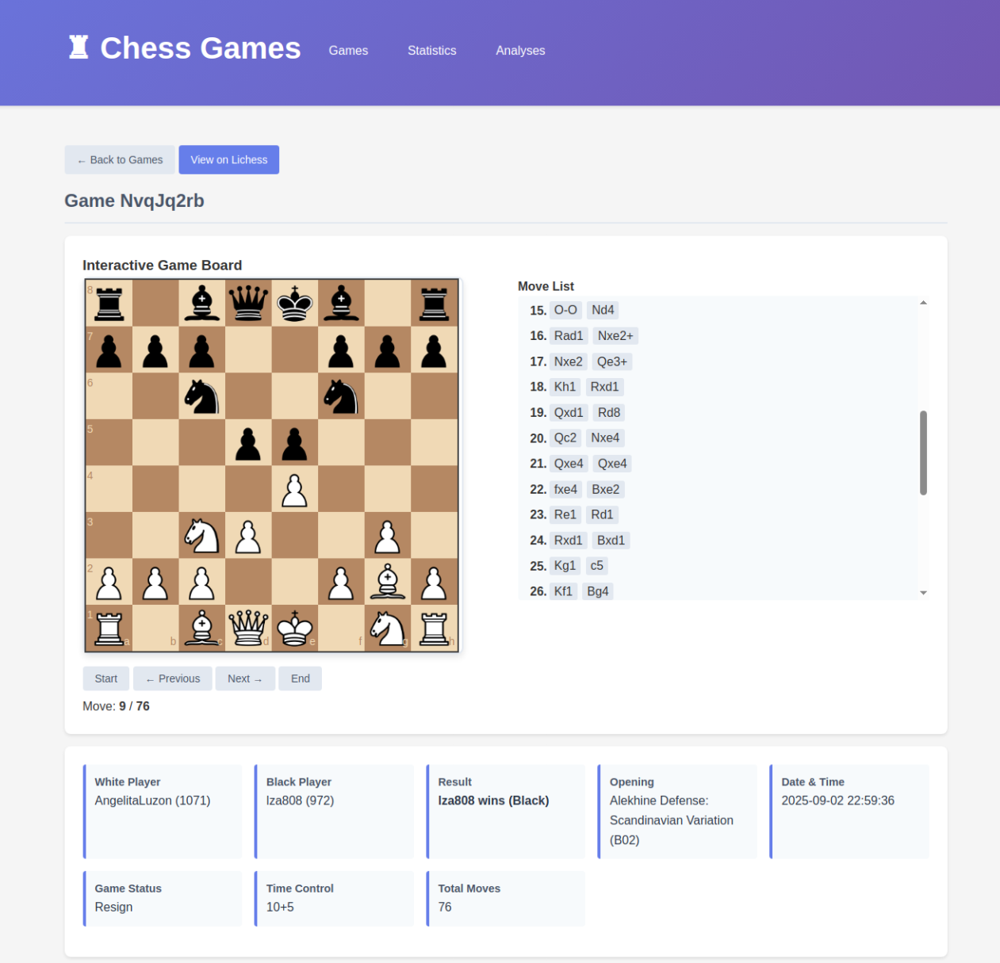

vibe coded this with claude to take lichess game data and analyze it with a local ollama. it renders a flask app which displays an interactive chess board and the LLM recommendations for my gameplay.

